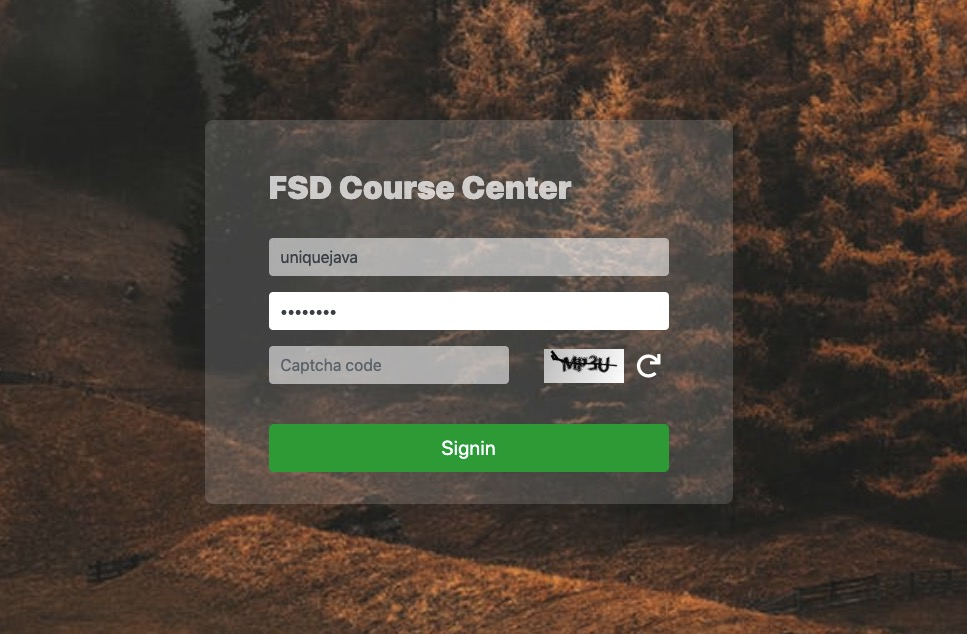
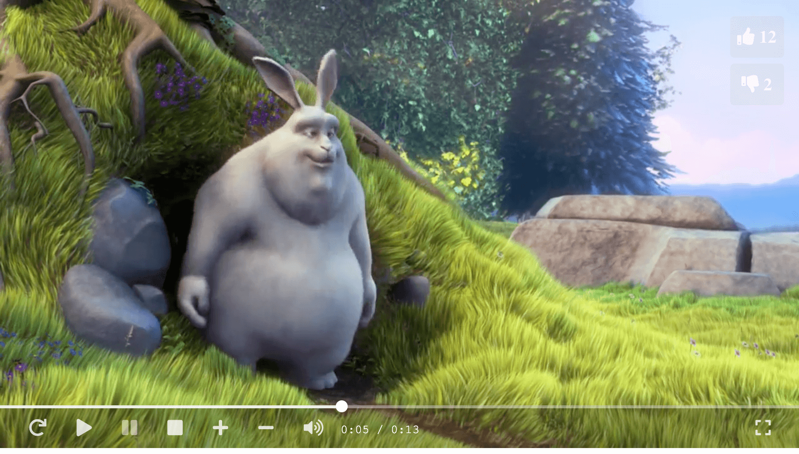

# FSD badge assignments

Try different tech stacks to build a html media player.

Source code: https://github.com/uniquejava/FSD

## Environment

1. macOS 10.14.6
2. Visual Studio Code 1.36.1 (prettier)
3. Intellij IDEA Community 2019
4. Spring Tool Suite 4 (editorconfig)

## Different Editions

1. [x] html5/css3/es6
2. [x] angular8
3. [x] react16
4. [x] java8
5. [x] spring mvc | jdbc | security (xml based) | jsp
6. [ ] spring boot | jpa | security (java config) | thymeleaf
7. [ ] spring cloud

## Other stacks(Bonus)

1. player vue edition
2. player flutter edition
3. backend node.js edition
