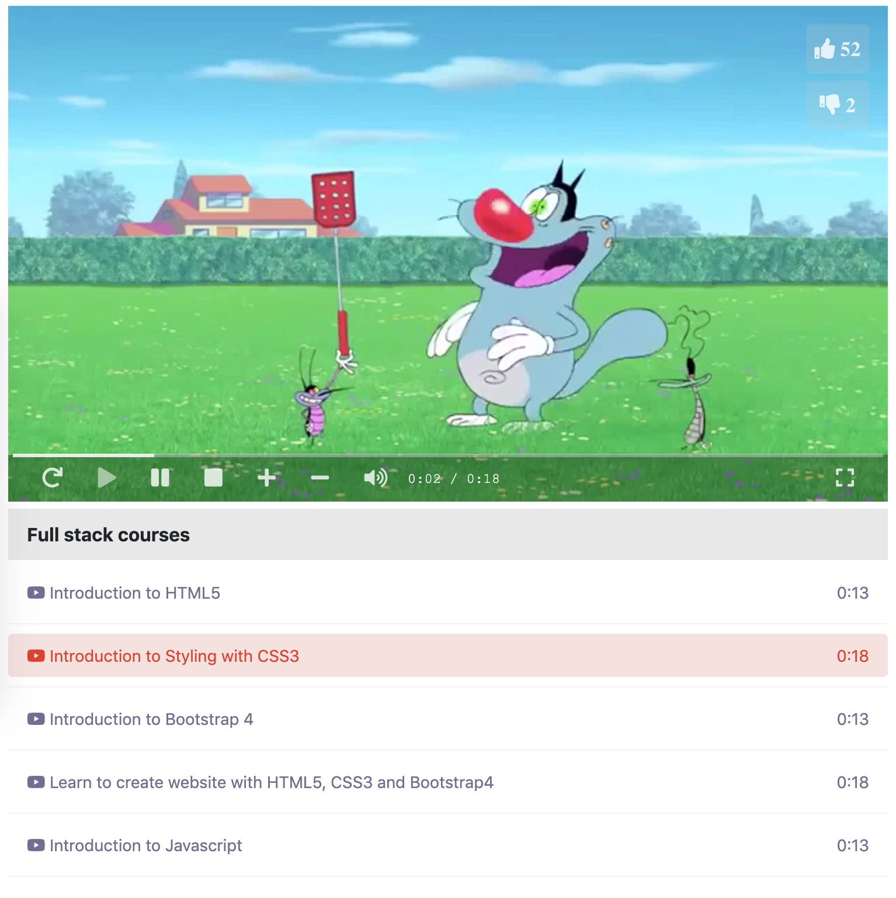

# FSD badge assignments

Try different tech stacks to build a html media player.

Source code: https://github.com/uniquejava/FSD

## Environment

1. macOS 10.14.x
2. VS Code
3. Intellij IDEA Community

## Different Editions

1. html/css3/es6
2. jquery/react
3. jquery/angular

## Other stacks(Bonus)

1. player vue edition
2. player flutter edition
3. backend node.js edition
