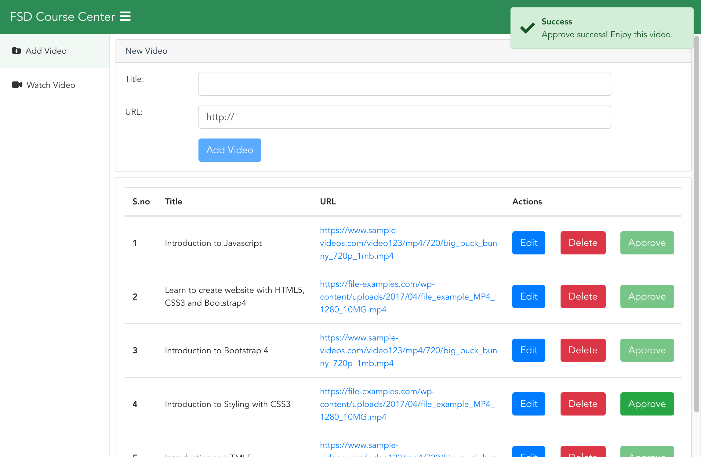

# Angular8 Media Player



### Tech stack

1. Angular 8.1
2. Routing
3. NgBootstrap/Bootstrap 4.3
4. Reactive Forms
5. Http Interceptors
6. Ngx Toast

### Project Structure

TODO

### Setup

```sh
git clone https://github.com/uniquejava/FSD.git

cd FSD
npm install -g json-server
json-server --watch json-server/db.json

cd lab02_angular8
npm i
ng serve # allow localhost only
ng serve --host 0.0.0.0  # via mobile browser
```

### Install notes

```sh
npm install -g @angular/cli
ng version
ng new --help
ng new smart-player # 以交互式的方式创建
ng new smart-player --skip-install --style scss --routing false # 跳过各种提示
ng build # 开发环境编译 使用environment.ts
ng build --prod # 生产环境使用environment.prod.ts


ng g c components/Playlist
```

### VSCode plugins

angular language service

angular files

### Versions

```
~1.0.0 => lock major.minor
^1.0.0 => lock major
 1.0.0 => lock major.minor.patch
```

### Prettier

保存时自动 fix tslint 错误， 需要安装 Prettier - Code Formatter 插件， `ext install esbenp.prettier-vscode`

### References

1. https://github.com/gothinkster/angular-realworld-example-app
2. https://angular.io/guide/styleguide
3. https://ng-bootstrap.github.io/#/components/modal/examples
4. [Angular Forms Tutorial (youtube)](https://www.youtube.com/playlist?list=PLC3y8-rFHvwhwL-XH04cHOpJnkgRKykFi)
5. [Color Scheme Designer (Chinese)](http://www.peise.net/tools/web/#)
