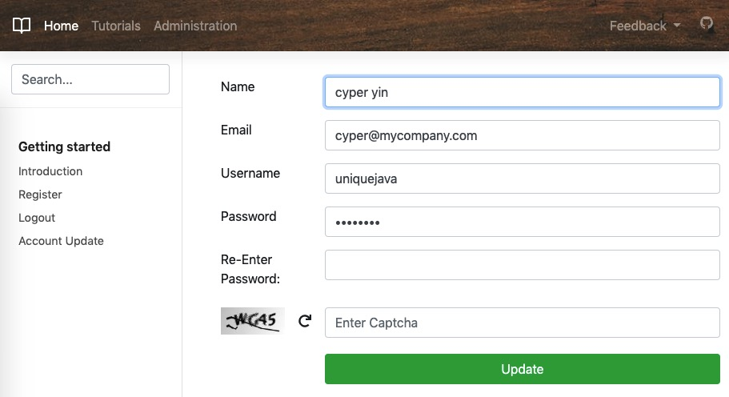

# Course App (spring mvc)



## Tech stack

1. [x] Spring MVC 5
2. [x] Spring Security 5
3. [x] Spring JDBC
4. [x] JSP/EL/JSTL
5. [x] Bootstrap 4.3
6. [x] Tomcat 9
7. [x] H2 In-Memory Database

## How to run

```sh
git clone https://github.com/uniquejava/FSD.git
cd FSD/lab05
mvn clean package
cp ./target/course-app.war TOMCAT_HOME/webapps
```

1. Build war file `mvn clean package`
2. Copy `target/course-app.war` to `<TOMCAT_HOME>/webapps`
3. Start up tomcat 9 server `sh <TOMCAT_HOME>/bin/startup.sh`
4. Open in browser: http://localhost:8080/course-app/

## Spring Security

[Spring Security Guides](https://docs.spring.io/spring-security/site/docs/current/guides/html5/)

## Exception Handling

https://www.baeldung.com/exception-handling-for-rest-with-spring

## Logging

https://www.mkyong.com/maven/how-to-create-a-web-application-project-with-maven/

## References

1. https://docs.spring.io/spring/docs/current/spring-framework-reference/web.html#mvc
2. https://howtodoinjava.com/spring5/webmvc/spring-dispatcherservlet-tutorial/
3. https://stackoverflow.com/questions/41577234/why-does-spring-mvc-respond-with-a-404-and-report-no-mapping-found-for-http-req
4. https://howtodoinjava.com/spring5/security5/security-java-config-enablewebsecurity-example/
5. https://stackoverflow.com/questions/35715065/it-throws-me-500-failed-to-evaluate-expression-role-user-in-spring-security
6. [What is the difference between spring factory-method and factory-bean?](https://stackoverflow.com/questions/18772490/what-is-the-difference-between-spring-factory-method-and-factory-bean)
7. https://github.com/linagora/linshare-core/blob/master/src/main/resources/springContext-security.xml
8. [写得贼好 Creating a Custom Login Form](https://docs.spring.io/spring-security/site/docs/current/guides/html5/form-javaconfig.html)
