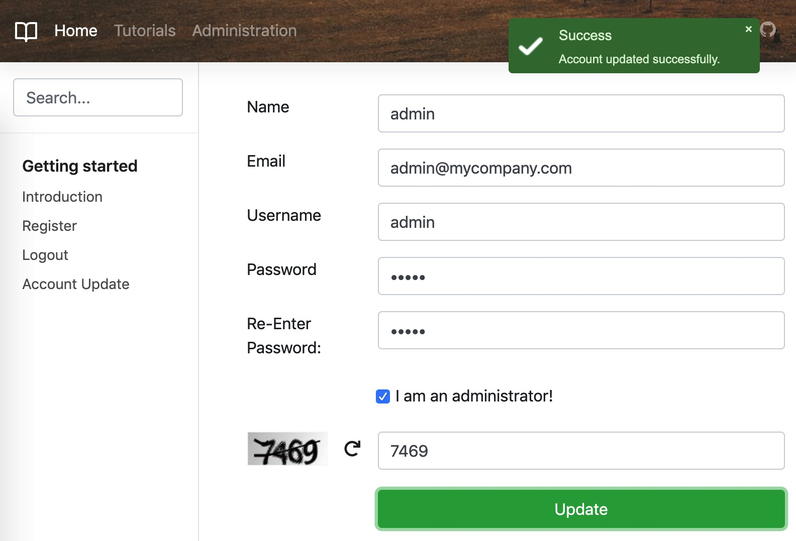

# Course App (spring boot)



## Tech stack

1. [x] Spring Boot 2.1.x
2. [x] Spring Security 5 (remember me)
3. [x] Spring Data JPA
4. [x] Spring Logging
5. [x] Spring Bean Validation (JSR-303)
6. [x] Spring Global Exception Handler
7. [x] Thymeleaf
8. [x] jQuery/Bootstrap 4.3/FontAwesome/webjars
9. [x] Tomcat 9
10. [x] H2 In-Memory Database

## How to run

```sh
git clone https://github.com/uniquejava/FSD.git
cd FSD/lab06/course-app
mvn spring-boot:run -Dspring.profiles.active=dev
```

1. Open in browser: http://localhost:8080/course-app/
2. Built-in users: `admin/admin` and `tomcat/tomcat`.

## Spring Security

[Official reference doc](https://docs.spring.io/spring-security/site/docs/5.1.6.RELEASE/reference/htmlsingle/#ns-config)

[Spring Security Guides](https://docs.spring.io/spring-security/site/docs/current/guides/html5/)

## Remember-Me Authentication

checkbox: `remember-me`

https://docs.spring.io/spring-security/site/docs/5.1.6.RELEASE/reference/htmlsingle/#remember-me

## JWT

[娓娓道来 REST Security with JWT using Java and Spring Security](https://www.toptal.com/java/rest-security-with-jwt-spring-security-and-java)

https://grokonez.com/spring-framework/spring-security/spring-boot-spring-security-jwt-authentication-architecture-tutorial

## CSRF

When should you use CSRF protection? Our recommendation is to use CSRF protection for any request that could be processed by a browser by normal users. If you are only creating a service that is used by non-browser clients, you will likely want to disable CSRF protection.

https://docs.spring.io/spring-security/site/docs/5.1.6.RELEASE/reference/htmlsingle/#csrf

## Exception Handling

https://www.baeldung.com/global-error-handler-in-a-spring-rest-api

https://www.baeldung.com/exception-handling-for-rest-with-spring

## Logging

https://www.mkyong.com/maven/how-to-create-a-web-application-project-with-maven/

https://stackoverflow.com/questions/30571319/spring-boot-logging-pattern

## Validation

https://lmonkiewicz.com/programming/get-noticed-2017/spring-boot-rest-request-validation/

https://www.baeldung.com/global-error-handler-in-a-spring-rest-api

## References

1. https://stackoverflow.com/questions/24916894/serving-static-web-resources-in-spring-boot-spring-security-application
